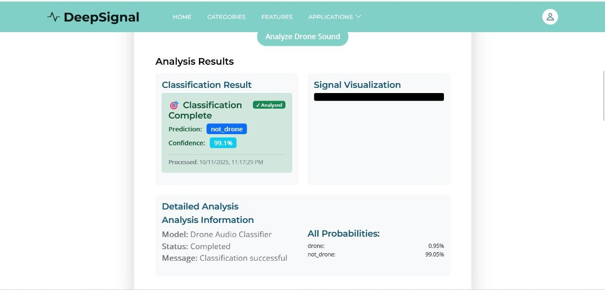
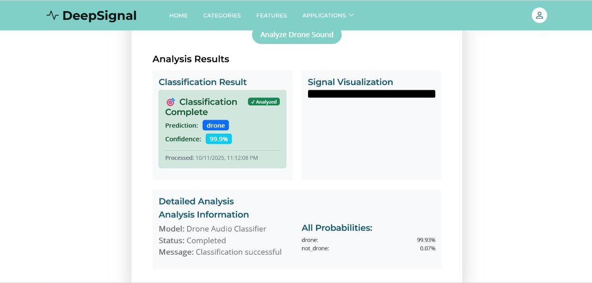

# DeepSignal: Signal Analysis Made Simple

**Live Website:** **[View Here](https://dsp-team-11.github.io/DeepSignal/)**

**Demo Video:** **[Watch Demo](https://drive.google.com/file/d/19MT04splctknZ6oLoesurHJnaQJ7FXdu/view?usp=sharing)**

**Team:** 
- **[Alaa Abdelnasser](https://github.com/Alaa-Fouad22)** 
- **[Sarah Sameh](https://github.com/sarah012-210)** 
- **[Samar Hatem](https://github.com/samar04052004)** 
- **[Mariam Sherif](https://github.com/mariamsherif04)**

## What is DeepSignal?

DeepSignal is a user-friendly web platform that helps you analyze different types of signals - from medical heartbeats to vehicle sounds and radio signals. No complicated setup required, just open your browser and start exploring.

  

## What Can You Do With DeepSignal?

### 🏥 Medical Signals Analysis

  

**For ECG (Heart Signals):**

  

- Upload your ECG data and instantly see if it shows any of 4 common heart conditions
- View your heart signals in different ways:

**Standard View**: Scroll through heartbeats, control speed, zoom in/out

  

  

**XOR View**: Spot differences between heartbeats easily

  

  

**Polar View**: See heart rhythms in a circular display
  
  

  

  

**Recurrence View**: Understand patterns between different heart channels

  

  

**For EEG (Brain Signals):**
- Detect four types of abnormal brain activity patterns
- Same easy-to-use viewers as ECG
- Perfect for researchers and students

  

  

### 🔊 Sound Analysis

  

**Doppler Effect Simulator:**
- Create the sound of a car passing by (you know that "weee-ooow" sound!)

  

  

- Adjust the car speed and horn frequency
- See the sound visualized as a spectrogram

  

- Download your created sounds
- Upload real car sounds to detect their speed and frequency automatically

  

**Drone Detection:**
- Upload any sound file

  

  

- Our AI will tell you if it contains drone sounds or not
- Great for security or hobbyist use

### 📡 Radio Signal Analysis

**SAR Image Analysis:**
- Upload satellite or radar images
- View them in grayscale and see detailed histograms
- Extract useful information from radio signals

  

## Check Out Our Latest Addition: Sampling & Aliasing Analysis

DeepSignal now includes cutting-edge sampling and aliasing analysis across all signal types. Understand how sampling rates affect signal quality and AI model performance in real-time.

### Multi-Signal Downsampling Analysis

**ECG Medical Signals:**
- **Real-time Undersampling**: Adjust ECG sampling rates from 250Hz down to critical levels
- **Aliasing Impact Assessment**: See how undersampling affects heart condition detection
- **Confidence Scoring**: Watch AI confidence drop as aliasing increases
- **Clinical Risk Evaluation**: Understand which heart conditions become harder to detect

**EEG Brain Signals:**
- **Frequency Domain Processing**: Apply Nyquist downsampling while preserving temporal relationships
- **Model Performance Comparison**: Compare original vs downsampled classification results
- **Neurological Impact Study**: See how sampling affects Alzheimer's, Parkinson's, and dementia detection
- **Multi-channel Analysis**: Process all 19 EEG channels simultaneously with consistent downsampling

**Voice & Acoustic Signals:**
- **Interactive Sampling Control**: Use sliders to adjust sampling rates from 1000Hz to 192000Hz
- **Real-time Aliasing Effects**: Hear how voice quality degrades as sampling decreases
- **Voice Gender Classification**: Test ECAPA-TDNN model performance under aliasing conditions
- **Quality Assessment**: Get instant feedback on audio quality levels from "Extreme Aliasing" to "High Quality"

**Drone Audio Detection:**
- **AI Model Robustness Testing**: See how drone detection confidence changes with sampling
- **Comparative Analysis**: Compare original vs aliased classification results
- **Real-world Impact**: Understand practical implications for security and monitoring systems

### Anti-Aliasing & Signal Recovery

**VoiceFixer AI Restoration:**
- **Two-Step Recovery Process**: First downsample to create aliasing, then restore with AI
- **Professional Audio Enhancement**: Remove aliasing artifacts and recover voice clarity
- **Multiple Restoration Modes**: Quality, Fast, and Super Fast processing options
- **Waveform Visualization**: See the restoration process in real-time with before/after comparisons

**Quality Assessment System:**
- **Automatic Quality Grading**: From "Extreme Aliasing" to "Professional Quality"
- **Nyquist Frequency Monitoring**: Real-time calculation of preserved frequency ranges
- **Confidence Impact Prediction**: Estimate how aliasing affects AI model reliability
- **Risk Warnings**: Get alerts about potential false positives/negatives

### Try These Demos:

1. **ECG Aliasing Impact**: 
   - Upload an ECG file and gradually reduce sampling rate
   - Watch how different heart conditions become harder to detect
   - See confidence scores drop as aliasing increases

<video src="https://github.com/DeepSignal/1_site_pics/raw/main/ecg%20downsampling%20(1).mp4" controls width="600"></video>

2. **Voice Quality Experiment**:
   - Record or upload voice audio
   - Drag sampling slider to hear quality degradation
   - Apply VoiceFixer to hear AI-powered restoration
   - Test gender classification under aliasing conditions

<video src="demo.mp4" width="600" controls></video>

3. **Drone Detection Robustness**:
   - Test drone audio with various sampling rates
   - See how detection confidence changes
   - Understand real-world implications for monitoring systems

<video src="demo.mp4" width="600" controls></video>

4. **EEG Sampling Study**:
   - Analyze brain signals with different sampling rates
   - Compare neurological condition detection accuracy
   - Learn about minimum sampling requirements for reliable diagnosis

<video src="demo.mp4" width="600" controls></video>

5. **Doppler Effect Exploration**:

- Generate different vehicle sounds with Doppler shift
- Upload real traffic recordings for speed analysis
- Experiment with different signal types and parameters
- Visualize frequency changes in spectrograms

### Educational Value & Practical Applications

**For Students & Researchers:**
- **Interactive Nyquist Theorem**: See sampling theory in action with real signals
- **Aliasing Artifact Visualization**: Understand what happens when sampling fails
- **Model Robustness Testing**: Learn how AI systems handle imperfect data
- **Signal Recovery Techniques**: Experience modern AI-powered restoration

**For Professionals:**
- **Medical Device Testing**: Evaluate how sampling rates affect diagnostic accuracy
- **Audio System Design**: Test microphone and recording system requirements
- **Security System Validation**: Ensure drone detection works under various conditions
- **Quality Control**: Establish minimum sampling rates for reliable analysis

### Easy-to-Use Sampling Controls

**Interactive Sliders:**
- Adjust sampling rates in real-time across all signal types
- See immediate effects on waveform visualization
- Hear audio quality changes instantly
- Watch AI confidence scores update dynamically

**Comparative Analysis:**
- Side-by-side comparison of original vs downsampled signals
- Real-time confidence scoring for both versions
- Quality assessment with specific warnings and recommendations
- Download both versions for offline analysis

## Easy-to-Use Features

### Simple Controls Everyone Can Use:
- **Play/Pause**: Start and stop signal playback
- **Speed Control**: Slow down or speed up signals
- **Zoom**: Get a closer look at important parts
- **Channel Selection**: Choose which signals to display

### AI That Actually Helps:
- Get instant analysis when you upload files
- Understand what the AI is detecting
- No machine learning knowledge needed

## Who Is This For?

- **Students** learning about signals, waves, and sampling theory
- **Researchers** analyzing medical or acoustic data with sampling considerations
- **Hobbyists** interested in sound analysis and audio processing
- **Healthcare professionals** needing quick signal reviews with quality assessment
- **Engineers** working with sensor data and sampling rate optimization
- **Educators** teaching digital signal processing and Nyquist theorem

## How to Get Started

1. **Visit our website** https://dsp-team-11.github.io/DeepSignal/
2. **Choose your signal type**: Medical, Sound, or Radio
3. **Upload your file** or use our sample data
4. **Explore the different viewers** to see your data in various ways
5. **Get AI insights** about what your signals contain
6. **Experiment with sampling** using our interactive downsampling controls
7. **Test anti-aliasing** with our VoiceFixer restoration system
